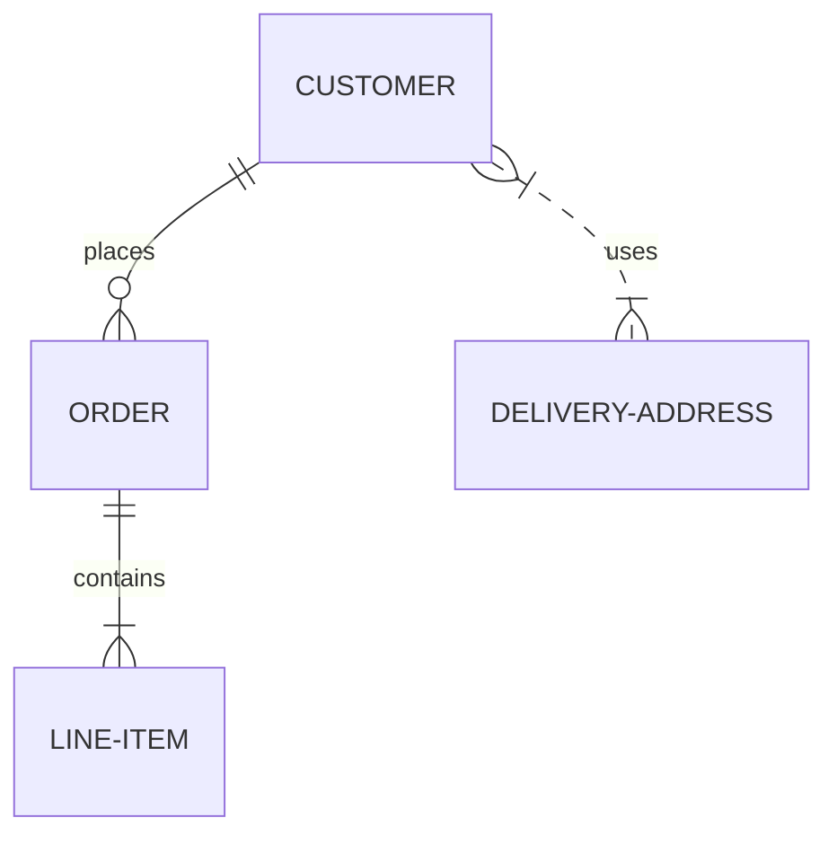

```
Модуль 4 клиент серверная разработка:
Frontent - клиентская часть (интерфейс) 1)HTML + CSS - стастика 2)JS (TavascriPt) React - динамика
Backend - сервер + бизнес логика (скриптовые сценарии обработки действий пользователий) + база данных
Node.JS это среда выполнения для JS построеная на движке V8 из хром, она позволяет запускать JS код вне браузера, на сервере.
Ключевые особенности и принцыпы:
Асинхронность и событийно аринтированная архитиктура
1)не блокирующий ввод - вывод:
когда серверу нужно выполнить ввода - вывода (прочитать файл с диска сделать запрос к базе данных и т.д) оно не ждёт её завершения вместо этого продолжает выполняться другой код
как только опирация завершается вызывается спец служба обработчик callback
2)отднопоточность с циклом событий:
в основе js лежит однопоточная модель. Однако это не значит что он может делать только 1 вещь за раз. Цикл событий - это механизм который постоянно проверяет, завершились ли какие либо асинхронные опирации, если опирация завершена он ставит её callback на выполнение.
2 особенность (дополнение) Node.JS это NPM, он поставляется со своим менеджером пакетов NPM - это огрмоная эко система открытых библиотек и инструментов которые легоко установить и использовать. И ещё 1 особенность это кросплотформенность.
Основной стэк технологий (технологический стэк):
PERN: P - PostgreSQL, E - Express (обработка http запросов), R - REACT (разработка клинтского интерфейса), N - Node.JS

ORM - (позволяет работать с базами данных как с объектами) - sequelize

Основные этапы разработки клиент сервера:
1) подготовка и инициализация проекта (VScode)
1.1 Создание дириктории проекта
1.2 Инициализация проекта
1.3 Установка необходимых зависимостей (модулей)
2) Создание базового HTTP сервера при помощи Express
2.1 Создание и настройка HTTP сервера (импорт фреемворка Express, создание экземпляра приложени, определение порта на котором сервер будет применять вход подключ)
2.2 Подключение и настройка промежуточного ПО, поключение программных компонентов которые обрабатывают входящие HTTP запрорсы до тогока они достигнут сервера
2.3 Подключение к БД с использование драйвера sequelize
3) Определение моделей данных
4) Созданиемаршрутов (роутос) IPwebpointov
4.1 разработка обработчиков для различных http запросов (GET, POST, PUT, DELETE) по определённым URL адресем (webpoint).
каждый маршрут может содержать по одному типу каждого http метода
5) реализатция контролеров:
5.1 написание функций - обработчиков которые превязаны к маршрутам, (эти функции содержат бизнес логику):
1.получают данные из запроса
2. взаимодействие с БД
3. отправляется ответ
6) обработка ошибок и волидации данных:
6.1 создание централизованного обработчика ошибок для грамотного ответа при сбоях
6.2 добавление функции в волидации входящих данных (проверка тела запроса, параметров) до передачи их в контролеры
7) тестирование IPIwebpointov:
тестирование webpointov и http с помощью програмы

GET запрос (получить):
select запрос. Он является безопасным и базовым и нужен только для получения информации с сервера (со стороны клиента)
POST запрос (создать/отправить):
create. это не безопасный запрос необходимый для добавления новых данных в БД через сервер
PUT запрос (обновить заменить):
update. не безопасный и идонпотентный
PATCH:
обновление по определёному блоку, не безопасный
DELETE:
удаляет например базу данных

HTTPcode: код ответов - это 3 значные числа которые сервер отправляет на http запрос
есть коды ответов:
1xx - информационные: уведомляют что сервер готов принять запрос
2xx - говорят об успешных операциях
3xx - говорят об перенапровлении
4xx - ошибка на стороне клиента (например 100 страниц а ты вводишь 101)
5xx - указывают на ошибки сервера (возникает из за багов в коде)


на вход поступает масив с экземпляроми объектов, необходимо написать функцию
написать скрипт который должен проходить по каждому объекту и для каждого его значения ключа рендерить таблицу и записывать туда данные 


```


--------------------------------------------------------------

```
echo "# название" >> README.md
git init
git add README.md
git commit -m "first commit"
git remote add origin https://github.com/stanruss/название.git
git push -u origin master

git log --oneline - посмотреть все коммиты.
git checkout . - восстановить все.
git checkout "код коммита" - вернуть до состояния этого коммита.
git checkout master - вернуться в ветку мастер.

Восстановить файлы на локальном компьютере:
git fetch --all
git reset --hard origin/master или git reset --hard origin/<название_ветки>

git add text.txt - Добавить файл в репозиторий
git rm text.txt - Удалить файл
git status - Текущее состояние репозитория (изменения, неразрешенные конфликты и тп)
git commit -a -m "Commit description" - Сделать коммит
git push origin - Замерджить все ветки локального репозитория на удаленный репозиторий 
git push origin master - Аналогично предыдущему, но делается пуш только ветки master
git push origin HEAD - Запушить текущую ветку, не вводя целиком ее название
git pull origin - Замерджить все ветки с удаленного репозитория
git pull origin master - Аналогично предыдущему, но накатывается только ветка master
git pull origin HEAD - Накатить текущую ветку, не вводя ее длинное имя
git fetch origin - Скачать все ветки с origin, но не мерджить их в локальный репозиторий
git fetch origin master - Аналогично предыдущему, но только для одной заданной ветки
git checkout -b some_branch origin/some_branch - Начать работать с веткой some_branch (уже существующей)
git branch some_branch - Создать новый бранч (ответвится от текущего)
git checkout some_branch - Переключиться на другую ветку (из тех, с которыми уже работаем)
git branch # звездочкой отмечена текущая ветвь - Получаем список веток, с которыми работаем
git branch -a # | grep something - Просмотреть все существующие ветви
git merge some_branch - Замерджить some_branch в текущую ветку
git branch -d some_branch - Удалить бранч (после мерджа)
git branch -D some_branch - Просто удалить бранч (тупиковая ветвь)
git show d8578edf8458ce06fbc5bb76a58c5ca4a58c5ca4 - Изменения, сделанные в заданном коммите
git push origin :branch-name - Удалить бранч из репозитория на сервере
git reset --hard d8578edf8458ce06fbc5bb76a58c5ca4a58c5ca4 - Откатиться к конкретному коммиту и удалить последующие (хэш смотрим в «git log»)
git push -f - залить на сервер измененные коммиты
git clean -f - Удаление untracked files

```


# Описание разметки файла README.md
Для описания проектов на GitHub используется README.md, который пишется на языке разметки markdown. Что и как поддерживается расписано ниже. Также существует еще один формат - [reStructuredText](https://github.com/GnuriaN/format-README/blob/master/README.rst), описание которого вынесено в отдельный файл `README.rst`.

## Оглавление

0. [Разделительная черта](#Разделительная-черта)
1. [Заголовки](#Заголовки)
2. [Работа с выделением текста](#Работа-с-выделением-текста)
3. [Использование эмодзи (emoji)](#Использование-эмодзи-emoji)
4. [Использование цитирования в тексте](#Использование-цитирования-в-тексте)
5. [Подсветка кода](#Подсветка-кода)
6. [Списки](#Списки)
    1. [Маркированный](#Маркированный)
    2. [Нумерованный](#Нумерованный)
    3. [Смешанные списки](#Смешанные-списки)
    4. [Список задач](#Список-задач)
7. [Ссылки](#Ссылки)
8. [Вставка изображения](#Вставка-изображения)
9. [Вставка таблиц](#Вставка-таблиц)
10. [Диаграммы Mermaid.js](#диаграммы-mermaidjs)
11. [Дополнения](https://github.com/GnuriaN/format-README/blob/master/Дополнения.md)
    
## Разделительная черта
При использовании
```
____
```
получается разделительная черта
____
[:arrow_up:Оглавление](#Оглавление)
___
## Заголовки

Всего существует шесть уровней заголовков. Для того, чтобы создать заголовок, необходимо в начале строки добавить символы `#`, в количестве равном его уровню.
____
# Заголовок первого уровня
```
# Заголовок 1
```
Заголовок первого уровня также можно создать:
```
Заголовок 1
===========
```
____
## Заголовок второго уровня
```
## Заголовок 2
```
Заголовок второго уровня также можно создать:
```
Заголовок 2
-----------
```
____
### Заголовок третьего уровня
```
### Заголовок 3
```
____
#### Заголовок четвертого уровня
```
#### Заголовок 4
```
____
##### Заголовок пятого уровня
```
##### Заголовок 5
```
____
###### Заголовок шестого уровня
```
###### Заголовок 6
```
____
[:arrow_up:Оглавление](#Оглавление)
____
## Работа с выделением текста

```
~~Зачеркнутый текст~~
```
~~Зачеркнутый текст (Strikethrough)~~

Для выделения текста **`жирным`** или *`наклонным`* и их сочетания можно использовать комбинации `*` или `_`

```
**Жирный текст (bold)**
```
**Жирный текст (bold)**

```
*Наклонный текст (italic)*
```
*Наклонный текст (italic)*

```
***Жирный наклонный текст (bold italic)***
```
***Жирный наклонный текст (bold italic)***

```
__Жирный текст (bold)__
```
__Жирный текст (bold)__

```
_Наклонный текст (italic)_
```
_Наклонный текст (italic)_

```
___Жирный наклонный текст (bold italic)___
```
___Жирный наклонный текст (bold italic)___

```
~~*__Тут странный текст__*~~
```
~~*__Тут странный текст__*~~
    
[:arrow_up:Оглавление](#Оглавление)
____
## Использование эмодзи (emoji)
В самом тексте можно использовать эмодзи, например написать вот так:    
:white_check_mark: Это уже сделано    
:negative_squared_cross_mark: Я не буду это делать    
:black_square_button: делать или не делать, вот в чем вопрос?    
В оригинале это выглядит так (в конце строки четыре (4) пробела для того, чтобы был переход на новую строку):
```
:white_check_mark: Это уже сделано    
:negative_squared_cross_mark: Я не буду это делать    
:black_square_button: делать или не делать, вот в чем вопрос?    
```

Список работающих Эмодзи находится тут -> [emoji.md](https://github.com/GnuriaN/format-README.md/blob/master/emoji.md)    
    
[:arrow_up:Оглавление](#Оглавление)
___
## Использование цитирования в тексте
```
> Цитата (уровень 1)    
> > Вложенная цитата (уровень 2)    
> > > Вложенная цитата (уровень 3)    

> > Продолжение цитаты (уровень 2)    

> Продолжение цитаты (уровень 1)    
```
> Цитата (уровень 1)    
> > Вложенная цитата (уровень 2)    
> > > Вложенная цитата (уровень 3)    

> > Продолжение цитаты (уровень 2)    

> Продолжение цитаты (уровень 1)    

Внешний вид, конечно, не очень, но может и пригодиться.

[:arrow_up:Оглавление](#Оглавление)
___
## Подсветка кода

Если нужно выделить слово или фразу внутри строки, то используются одинарные обратные кавычки (`):

    Это `слово` будет выделено

Для выделения в блоки - тройные:

    ```
        Здесь может быть
        Ваша реклама
    ```

Дополнительно можно задавать язык кода внутри блока, указав его после первых трех кавычек:

    ```html
        <input type="text">
    ```

    ```css
        body {
            margin: 0;
            padding: 0;
        }
    ```

    ```php
        <?php phpinfo();?>
    ```

Пример блока для `C#`:

```C#
using MarkdownSharp;
using MarkdownSharp.Extensions.Mal;

Markdown mark = new Markdown();

// Short link for MAL - 
// http://myanimelist.net/people/413/Kitamura_Eri => mal://Kitamura_Eri
mark.AddExtension(new Articles()); 
mark.AddExtension(new Profile());

mark.Transform(text);
```

Пример блока для `Python`:
```Python
from timeit import Timer

tmp = "Python 3.2.2 (default, Jun 12 2011, 15:08:59) [MSC v.1500 32 bit (Intel)] on win32."

def case1(): # А. инкрементальные конкатенации в цикле
    s = ""
    for i in range(10000):
        s += tmp

def case2(): # Б. через промежуточный список и метод join
    s = []
    for i in range(10000):
        s.append(tmp)
    s = "".join(s)

def case3(): # В. списковое выражение и метод join
    return "".join([tmp for i in range(10000)])

def case4(): # Г. генераторное выражение и метод join
    return "".join(tmp for i in range(10000))

for v in range(1,5):
    print (Timer("func()","from __main__ import case%s as func" % v).timeit(200))
```
    
[:arrow_up:Оглавление](#Оглавление)
___
## Списки

#### Маркированный
Задать **маркированный** список можно несколькими символами `-`, `+` или `*`:
```
- Уровень списка 1. Пункт 1.
- Уровень списка 1. Пункт 2.
- Уровень списка 1. Пункт 3.
```
- Уровень списка 1. Пункт 1.
- Уровень списка 1. Пункт 2.
- Уровень списка 1. Пункт 3.

```
+ Уровень списка 1. Пункт 1.
+ Уровень списка 1. Пункт 2.
+ Уровень списка 1. Пункт 3.
```
+ Уровень списка 1. Пункт 1.
+ Уровень списка 1. Пункт 2.
+ Уровень списка 1. Пункт 3.

```
* Уровень списка 1. Пункт 1.
* Уровень списка 1. Пункт 2.
* Уровень списка 1. Пункт 3.
```
* Уровень списка 1. Пункт 1.
* Уровень списка 1. Пункт 2.
* Уровень списка 1. Пункт 3.

Можно создавать многоуровневые списки. Каждый уровень отделяется **четырьмя** (4) пробелами:
```
- Уровень списка 1. Пункт 1.
    - Уровень списка 2. Пункт 1.
- Уровень списка 1. Пункт 2.
    - Уровень списка 2. Пункт 1.
    - Уровень списка 2. Пункт 2.
- Уровень списка 1. Пункт 3.
    - Уровень списка 2. Пункт 1.
        - Уровень списка 3. Пункт 1.
        - Уровень списка 3. Пункт 2.
           - Уровень списка 4. Пункт 1.
```
- Уровень списка 1. Пункт 1.
  - Уровень списка 2. Пункт 1.
- Уровень списка 1. Пункт 2.
    - Уровень списка 2. Пункт 1.
    - Уровень списка 2. Пункт 2.
- Уровень списка 1. Пункт 3.
    - Уровень списка 2. Пункт 1.
      - Уровень списка 3. Пункт 1.
      - Уровень списка 3. Пункт 2.
         - Уровень списка 4. Пункт 1.

Каждый уровень отделяется двумя пробелами.

#### Нумерованный
Для Githib работа с нумерованными списками выглядит очень интересно. Каждый уровень отделяется **четырьмя** (4) пробелами:
```
1. Первый уровень 1
    1. Второй уровень 1
        1. Третий уровень 1
            1. Четвертый уровень 1
                1. Пятый уровень 1
                    1. Шестой уровень
                        1. Седьмой уровень
                            1. Седьмой уровень
2. Первый уровень 2
2. Первый уровень (должно быть 3)
4. Первый уровень 4
```
1. Первый уровень 1
    1. Второй уровень 1
        1. Третий уровень 1
            1. Четвертый уровень 1
                1. Пятый уровень 1
                    1. Шестой уровень
                        1. Седьмой уровень
                            1. Седьмой уровень
2. Первый уровень 2
2. Первый уровень (должно быть 3)
4. Первый уровень 4

#### Смешанные списки
При использовании смешанных списков нужно очень внимательно следить за нумерацией. Лучше, как и в нумерованных, использовать четыре (4) пробела для отделения уровня.
```
1. Первый уровень "нумерованный" - 1
    * Второй уровень "маркер"
        + Третий уровень "маркер"
        - Третий уровень "маркер"
        1. Третий уровень "нумерованный" - 1
            1. Четвертый уровень "нумерованный" - 1
                1. Пятый уровень "нумерованный" - 1
                    1. Шестой уровень "нумерованный" - 1
                        1. Седьмой уровень "нумерованный" - 1
                        * Седьмой уровень "маркер"
                        2. Седьмой уровень "нумерованный" - 1 (нарушена нумерация, новая нумерация 1)
                        3. Седьмой уровень "нумерованный" - 1 (нарушена нумерация, новая нумерация 2)
                            1. Восьмой уровень "нумерованный" - 1
2. Первый уровень "нумерованный" - 2
- Первый уровень "нумерованный" - 3
4. Первый уровень "нумерованный" - 4 (нарушена нумерация, новая нумерация 1)
5. Первый уровень "нумерованный" - 5 (нарушена нумерация, новая нумерация 2)
```
1. Первый уровень "нумерованный" - 1
    * Второй уровень "маркер"
        + Третий уровень "маркер"
        - Третий уровень "маркер"
        1. Третий уровень "нумерованный" - 1
            1. Четвертый уровень "нумерованный" - 1
                1. Пятый уровень "нумерованный" - 1
                    1. Шестой уровень "нумерованный" - 1
                        1. Седьмой уровень "нумерованный" - 1
                        * Седьмой уровень "маркер"
                        2. Седьмой уровень "нумерованный" - 2
                        3. Седьмой уровень "нумерованный" - 3
                            1. Восьмой уровень "нумерованный" - 1
2. Первый уровень "нумерованный" - 2
- Первый уровень "маркерный" - 3
4. Первый уровень "нумерованный" - 4 (хотя по идее должен быть 3)
5. Первый уровень "нумерованный" - 5 (хотя, по идее должен быть 3)

#### Список задач
(Task List)
Можно создавать "Списки задач" для этого необходимо использовать `- [ ]` для поставленной задачи и `- [X]` для выполненной задачи.
```
- [X] Придумать внешний вид резюме
- [ ] Написать основные категории
- [X] Опубликовать

```
- [X] Придумать внешний вид резюме
- [ ] Написать основные категории
- [X] Опубликовать

Также можно создавать многоуровневые списки задач. Каждый уровень отделяется **четырьмя** (4) пробелами:
```
- [X] Задача 1
    - [X] Подзадача 1 для Задачи 1
    - [X] Подзадача 2 для Задачи 1
- [ ] Задача 2
    - [X] Подзадача 1 для Задачи 2
    - [ ] Подзадача 2 для Задачи 2
- [ ] Задача 3
    - [ ] Подзадача 1 для Задачи 3
        - [ ] Подзадача 1 для Подзадача 1 для Задачи 3
```
- [X] Задача 1
    - [X] Подзадача 1 для Задачи 1
    - [X] Подзадача 2 для Задачи 1
- [ ] Задача 2
    - [X] Подзадача 1 для Задачи 2
    - [ ] Подзадача 2 для Задачи 2
- [ ] Задача 3
    - [ ] Подзадача 1 для Задачи 3
        - [ ] Подзадача 1 для Подзадача 1 для Задачи 3
    
[:arrow_up:Оглавление](#Оглавление) 
___
## Ссылки
Либо просто вставить ссылку, либо дополнительно задать текст ссылки (пробела между скобками быть не должно):
```
Первый вариант вставки ссылок - это просто написать адрес сайта http://sabaka.net
```
Первый вариант вставки ссылок - это просто написать адрес сайта http://sabaka.net

Второй вариант записывается так: `[текст ссылки](адрес ссылки)`
```
[sabaka.net](http://sabaka.net)
```
[sabaka.net](http://sabaka.net)
    
[Sabaka(DOT)Net]:http://sabaka.net    
    
[:arrow_up:Оглавление](#Оглавление)
____
## Вставка таблиц
```
| LEFT | CENTER | RIGHT |
|----------------|:---------:|----------------:|
| По левому краю | По центру | По правому краю |
| текст | текст | текст |
```
| LEFT | CENTER | RIGHT |
|----------------|:---------:|----------------:|
| По левому краю | По центру | По правому краю |
| текст | текст | текст |

**Внимание:** Если в тексте таблицы нужно использовать символ "вертикальная черта - `|`", то в место него необходимо написать замену на комбинацию HTML-кода* `&#124;`, это нужно для того, чтобы таблица не потеряла ориентации.    
*) - Можно использовать ASCII и/или UTF коды.

**Пример:**
```
| Обозначение | Описание | Пример регулярного выражения|
|----:|:----:|:----------|
| literal | Строка содержит символьный литерал literal | foo |
| re1&#124;re2 | Строка содержит регулярные выражения `rel` или `re2` | foo&#124;bar |
```
**Результат:**

| Обозначение | Описание | Пример регулярного выражения|
|----:|:----:|:----------|
| literal | Строка содержит символьный литерал literal | foo |
| re1&#124;re2 | Строка содержит регулярные выражения `rel` или `re2` | foo&#124;bar |

[:arrow_up:Оглавление](#Оглавление) 
____
## Диаграммы Mermaid.js
Появилась возможность вставлять диаграммы [Mermaid.js](https://mermaid-js.github.io/mermaid/#/)

<pre>
```mermaid
... код диаграммы ...
```
</pre>
Пример:
<pre>

</pre>

Очень подробно на русском языке о диаграммах Mermaid.js: https://habr.com/ru/post/652867/ 

[:arrow_up:Оглавление](#Оглавление) 
____
